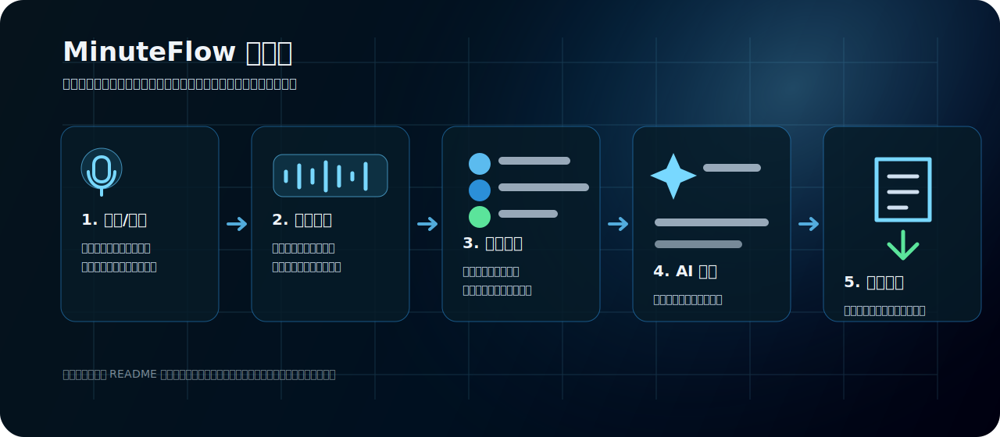
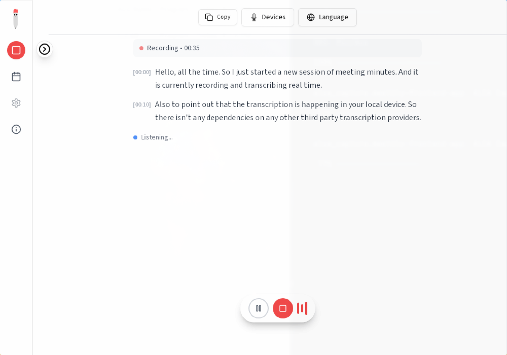
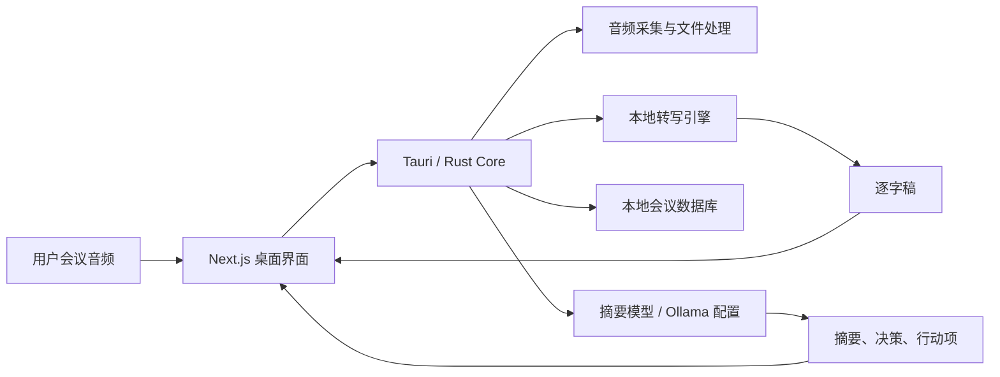

<p align="center">
  
</p>

<h1 align="center">MinuteFlow</h1>

<p align="center">
  本地优先的 AI 会议转录与摘要助手，把录音、实时转写、会议纪要和行动项整理放在一个轻量桌面工作台里。
</p>

<p align="center">
  <a href="https://github.com/2370318075-gif/meeting/releases/latest"></a>
  <a href="./LICENSE.md"></a>
  
  
</p>

<p align="center">
  <a href="#快速开始">快速开始</a>
  ·
  <a href="#界面流程">界面流程</a>
  ·
  <a href="#核心功能">核心功能</a>
  ·
  <a href="#本地开发">本地开发</a>
  ·
  <a href="#架构">架构</a>
</p>



## 为什么是 MinuteFlow

MinuteFlow 面向需要快速整理会议内容的个人和团队：开会时记录音频，会议结束后得到逐字稿、摘要、关键决策和待办事项。它优先使用本地桌面能力完成录音、转写、存储和文件管理，适合对会议资料可控性、复盘效率和轻量工作流有要求的用户。

适合这些场景：

- 会议结束后快速得到可复制的纪要和行动项。
- 录制访谈、课程、复盘、沟通会，并生成带时间戳的文本。
- 在本机保存会议资料，减少对云端转写服务的依赖。
- 给非技术用户提供开箱即用的桌面安装包。

## 界面流程

| 步骤 | 界面动作 | 输出结果 |
| --- | --- | --- |
| 1. 录制或导入 | 点击左侧录制按钮，或导入已有音频文件 | 创建一场会议记录 |
| 2. 本地转写 | 应用读取音频并调用本地转写能力 | 生成带时间戳的逐字稿 |
| 3. 浏览校正 | 在转录区查看分段内容，必要时补充上下文 | 得到更准确的会议材料 |
| 4. 生成摘要 | 点击摘要按钮，选择语言和模型配置 | 生成重点、决策、行动项 |
| 5. 保存导出 | 保存、复制或打开会议文件夹 | 复用到文档、飞书、邮件或项目管理工具 |

### 主界面


主界面保持轻量：左侧是录制、导入、会议列表和设置入口；中间区域根据当前会议状态显示实时转写或会议内容。

### 转写界面



转写区突出时间戳和正文，适合会议中实时浏览，也方便会议结束后按时间回看。

## 核心功能

- **本地录音**：支持会议录音入口，面向桌面会议场景设计。
- **音频导入**：可以把已有音频导入后重新整理成会议文本。
- **实时转写**：会议进行中持续生成逐字稿，便于边听边看。
- **AI 摘要**：从转录内容中提炼会议摘要、关键决策、讨论要点和行动项。
- **中文界面**：主要下载、设置、摘要和提示流程已面向中文用户整理。
- **模型管理**：首次使用会引导下载或配置所需模型；摘要模型可按本机环境配置。
- **桌面应用**：基于 Tauri 打包，提供接近原生应用的窗口、文件和权限体验。
- **隐私优先**：会议数据存储在本机，核心转写链路围绕本地桌面能力运行。

## 快速开始

### 下载安装包

当前公开 Release 提供 macOS Apple Silicon 版本：

[下载 MinuteFlow_0.4.0_aarch64.dmg](https://github.com/2370318075-gif/meeting/releases/download/v0.4.0-minuteflow.1/MinuteFlow_0.4.0_aarch64.dmg)

安装后首次打开：

1. 把 `MinuteFlow.app` 拖入 `Applications`。
2. 打开应用并允许麦克风权限。
3. 按引导下载或配置转写/摘要模型。
4. 点击录制按钮开始会议，或用导入入口处理已有音频。

> 说明：当前安装包是 Apple Silicon 版，适用于 M 系列 Mac。Intel Mac、Windows 或 Linux 需要从源码构建对应平台安装包。

## 从源码运行

### 环境要求

- Node.js 18+
- pnpm 8+
- Rust stable
- macOS 构建需要 Xcode Command Line Tools

### 本地开发

```bash
git clone https://github.com/2370318075-gif/meeting.git
cd meeting/frontend
pnpm install
pnpm run tauri:dev
```

### 构建安装包

```bash
cd frontend
pnpm run build
pnpm run tauri:build
```

更多构建和加速说明：

- [Building from Source](docs/BUILDING.md)
- [GPU Acceleration](docs/GPU_ACCELERATION.md)
- [Architecture](docs/architecture.md)

## 架构



项目主体由三部分组成：

- `frontend/src`：Next.js、React、Tailwind UI 和会议交互界面。
- `frontend/src-tauri`：Tauri/Rust 桌面能力，包括音频、文件、模型和系统集成。
- `docs`：构建、架构、GPU 加速和 README 展示素材。

## 项目结构

```text
.
├── frontend/              # 桌面应用主体
│   ├── src/               # Next.js 前端界面
│   ├── src-tauri/         # Tauri / Rust 桌面端
│   └── public/            # 图标与静态资源
├── docs/                  # 文档和展示图片
├── backend/               # 历史后端归档，仅作兼容参考
├── llama-helper/          # 本地摘要/模型辅助组件
└── scripts/               # 构建与维护脚本
```

## 常见问题

**模型下载失败怎么办？**

网络不稳定时可以先重试。摘要模型体积较大，下载过程中不要关闭应用。如果本机已经有 Ollama 或其他可用模型，也可以在应用里配置模型后继续使用摘要功能。

**这个项目会把会议上传到云端吗？**

应用的核心录音、转写和会议存储是围绕本机运行的。是否使用外部模型取决于你的摘要模型配置；如果你选择本地模型，会议摘要也可以留在本机环境中完成。

**为什么 Release 只有一个安装包？**

当前公开的是 macOS Apple Silicon 构建。其他平台需要在对应系统上构建，或者后续补充 CI 自动发布。

## 贡献

欢迎提交 Issue 和 Pull Request。开始前请阅读 [CONTRIBUTING.md](CONTRIBUTING.md)。

## License

本项目基于 [MIT License](LICENSE.md) 发布。
